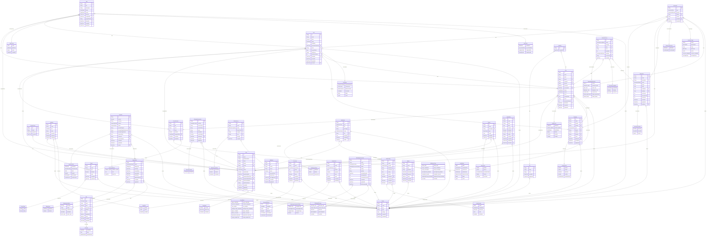

```mermaid
erDiagram

        UserRole {
            ADMIN ADMIN
USER USER
VIEWER VIEWER
        }
    


        UserStatus {
            ACTIVE ACTIVE
INACTIVE INACTIVE
PENDING PENDING
        }
    


        PlanType {
            STARTER STARTER
PRO PRO
ENTERPRISE ENTERPRISE
        }
    


        SubscriptionStatus {
            ACTIVE ACTIVE
TRIAL TRIAL
CANCELLED CANCELLED
EXPIRED EXPIRED
PAST_DUE PAST_DUE
        }
    


        BillingCycle {
            MONTHLY MONTHLY
YEARLY YEARLY
        }
    


        PaymentMethod {
            CREDIT_CARD CREDIT_CARD
PIX PIX
BOLETO BOLETO
        }
    


        PaymentStatus {
            PENDING PENDING
PROCESSING PROCESSING
PAID PAID
FAILED FAILED
REFUNDED REFUNDED
CANCELLED CANCELLED
        }
    


        FunnelType {
            LEAD LEAD
DEAL DEAL
        }
    


        ScoreEvent {
            LEAD_CREATED LEAD_CREATED
STATUS_CHANGED STATUS_CHANGED
TAG_ADDED TAG_ADDED
INTERACTION_CREATED INTERACTION_CREATED
EMAIL_OPENED EMAIL_OPENED
EMAIL_CLICKED EMAIL_CLICKED
WHATSAPP_REPLIED WHATSAPP_REPLIED
FORM_SUBMITTED FORM_SUBMITTED
        }
    


        CompanySize {
            MICRO MICRO
SMALL SMALL
MEDIUM MEDIUM
LARGE LARGE
ENTERPRISE ENTERPRISE
        }
    


        DealStage {
            QUALIFICATION QUALIFICATION
PROPOSAL PROPOSAL
NEGOTIATION NEGOTIATION
CLOSING CLOSING
WON WON
LOST LOST
        }
    


        LeadStatus {
            NEW NEW
CONTACTED CONTACTED
QUALIFIED QUALIFIED
PROPOSAL PROPOSAL
NEGOTIATION NEGOTIATION
WON WON
LOST LOST
        }
    


        LeadSource {
            WEBSITE WEBSITE
SOCIAL_MEDIA SOCIAL_MEDIA
REFERRAL REFERRAL
EMAIL EMAIL
PHONE PHONE
OTHER OTHER
        }
    


        TaskStatus {
            PENDING PENDING
IN_PROGRESS IN_PROGRESS
COMPLETED COMPLETED
CANCELLED CANCELLED
        }
    


        TaskPriority {
            LOW LOW
MEDIUM MEDIUM
HIGH HIGH
URGENT URGENT
        }
    


        CalendarProvider {
            GOOGLE GOOGLE
        }
    


        AutomationStatus {
            ACTIVE ACTIVE
PAUSED PAUSED
DRAFT DRAFT
        }
    


        AutomationLogStatus {
            SUCCESS SUCCESS
ERROR ERROR
SKIPPED SKIPPED
        }
    


        AutomationStepType {
            DELAY DELAY
UPDATE_LEAD UPDATE_LEAD
ADD_TAG ADD_TAG
REMOVE_TAG REMOVE_TAG
CONDITION CONDITION
SEND_WHATSAPP SEND_WHATSAPP
SEND_EMAIL SEND_EMAIL
        }
    


        InteractionType {
            EMAIL EMAIL
WHATSAPP WHATSAPP
CALL CALL
MEETING MEETING
NOTE NOTE
STATUS_CHANGE STATUS_CHANGE
AUTOMATION AUTOMATION
        }
    


        InteractionDirection {
            INBOUND INBOUND
OUTBOUND OUTBOUND
        }
    


        CustomFieldType {
            TEXT TEXT
NUMBER NUMBER
DATE DATE
SELECT SELECT
TEXTAREA TEXTAREA
CHECKBOX CHECKBOX
        }
    


        WebhookLogStatus {
            SUCCESS SUCCESS
FAILED FAILED
PENDING PENDING
        }
    


        WhatsAppProvider {
            OFFICIAL_API OFFICIAL_API
EVOLUTION_API EVOLUTION_API
BAILEYS BAILEYS
WPPCONNECT WPPCONNECT
CHATAPI CHATAPI
        }
    


        WhatsAppConnectionStatus {
            CONNECTED CONNECTED
DISCONNECTED DISCONNECTED
CONNECTING CONNECTING
ERROR ERROR
        }
    


        EmailProvider {
            SMTP SMTP
SENDGRID SENDGRID
MAILGUN MAILGUN
SES SES
RESEND RESEND
        }
    


        NotificationType {
            TASK_DUE TASK_DUE
TASK_OVERDUE TASK_OVERDUE
LEAD_ASSIGNED LEAD_ASSIGNED
AUTOMATION_ERROR AUTOMATION_ERROR
PAYMENT_FAILED PAYMENT_FAILED
SUBSCRIPTION_EXPIRING SUBSCRIPTION_EXPIRING
SYSTEM SYSTEM
        }
    


        NotificationStatus {
            UNREAD UNREAD
READ READ
ARCHIVED ARCHIVED
        }
    


        ReportType {
            LEADS LEADS
SALES SALES
AUTOMATIONS AUTOMATIONS
TASKS TASKS
CUSTOM CUSTOM
        }
    
  "User" {
    String id "🗝️"
    String email 
    String passwordHash 
    String name 
    String phone "❓"
    String avatar "❓"
    UserRole role 
    UserStatus status 
    Boolean emailVerified 
    DateTime emailVerifiedAt "❓"
    String passwordResetToken "❓"
    DateTime passwordResetExpires "❓"
    Boolean twoFactorEnabled 
    String twoFactorSecret "❓"
    DateTime createdAt 
    DateTime updatedAt 
    DateTime lastLoginAt "❓"
    }
  

  "RefreshToken" {
    String id "🗝️"
    String token 
    DateTime expiresAt 
    DateTime createdAt 
    }
  

  "Invitation" {
    String id "🗝️"
    String email 
    UserRole role 
    String token 
    Boolean accepted 
    DateTime expiresAt 
    DateTime createdAt 
    }
  

  "Tenant" {
    String id "🗝️"
    String name 
    String slug 
    String logo "❓"
    Json settings 
    DateTime createdAt 
    DateTime updatedAt 
    }
  

  "Plan" {
    String id "🗝️"
    PlanType type 
    String name 
    Decimal price 
    String description "❓"
    Json features 
    Json limits 
    Boolean highlighted 
    Boolean active 
    DateTime createdAt 
    DateTime updatedAt 
    }
  

  "Subscription" {
    String id "🗝️"
    SubscriptionStatus status 
    BillingCycle billingCycle 
    DateTime startDate 
    DateTime renewalDate 
    DateTime cancelledAt "❓"
    DateTime trialEndsAt "❓"
    Json paymentMethod "❓"
    DateTime createdAt 
    DateTime updatedAt 
    }
  

  "Payment" {
    String id "🗝️"
    Decimal amount 
    String currency 
    PaymentMethod method 
    PaymentStatus status 
    String mercadoPagoId "❓"
    String mercadoPagoPreferenceId "❓"
    String mercadoPagoStatus "❓"
    Json paymentData "❓"
    String invoiceUrl "❓"
    String invoiceNumber "❓"
    DateTime createdAt 
    DateTime updatedAt 
    DateTime paidAt "❓"
    }
  

  "Funnel" {
    String id "🗝️"
    String name 
    FunnelType type 
    Boolean isDefault 
    Int order 
    DateTime createdAt 
    DateTime updatedAt 
    }
  

  "FunnelColumn" {
    String id "🗝️"
    String title 
    String color 
    Int order 
    Boolean isDefault 
    LeadStatus mappedStatus "❓"
    DateTime createdAt 
    DateTime updatedAt 
    }
  

  "ScoreRule" {
    String id "🗝️"
    String name 
    ScoreEvent eventType 
    Int points 
    String description "❓"
    Boolean active 
    Json conditions "❓"
    DateTime createdAt 
    DateTime updatedAt 
    }
  

  "Company" {
    String id "🗝️"
    String name 
    String domain "❓"
    String industry "❓"
    CompanySize size "❓"
    String phone "❓"
    String address "❓"
    String website "❓"
    String notes "❓"
    DateTime deletedAt "❓"
    DateTime createdAt 
    DateTime updatedAt 
    }
  

  "Deal" {
    String id "🗝️"
    String name 
    Decimal value 
    DealStage stage 
    Int probability 
    DateTime expectedCloseDate "❓"
    String notes "❓"
    Json customFields 
    String lostReason "❓"
    Int positionInColumn 
    DateTime deletedAt "❓"
    DateTime createdAt 
    DateTime updatedAt 
    DateTime closedAt "❓"
    }
  

  "Lead" {
    String id "🗝️"
    String name 
    String email "❓"
    String phone "❓"
    String company "❓"
    String position "❓"
    Boolean isContact 
    DateTime convertedAt "❓"
    LeadStatus status 
    LeadSource source 
    Int score 
    Json customFields 
    String notes "❓"
    Int positionInColumn 
    DateTime deletedAt "❓"
    DateTime createdAt 
    DateTime updatedAt 
    }
  

  "Tag" {
    String id "🗝️"
    String name 
    String color 
    DateTime createdAt 
    DateTime updatedAt 
    }
  

  "LeadTag" {
    String id "🗝️"
    DateTime createdAt 
    }
  

  "CustomField" {
    String id "🗝️"
    String name 
    CustomFieldType type 
    Json options "❓"
    Boolean required 
    Int order 
    Boolean active 
    DateTime createdAt 
    DateTime updatedAt 
    }
  

  "Task" {
    String id "🗝️"
    String title 
    String description "❓"
    TaskStatus status 
    TaskPriority priority 
    DateTime dueDate "❓"
    DateTime completedAt "❓"
    String googleEventId "❓"
    DateTime deletedAt "❓"
    DateTime createdAt 
    DateTime updatedAt 
    }
  

  "CalendarConnection" {
    String id "🗝️"
    CalendarProvider provider 
    String accessToken 
    String refreshToken 
    String email 
    String calendarId 
    Boolean syncEnabled 
    DateTime lastSyncAt "❓"
    DateTime createdAt 
    DateTime updatedAt 
    }
  

  "Automation" {
    String id "🗝️"
    String name 
    String description "❓"
    AutomationStatus status 
    Json trigger 
    Json steps 
    Json conditions "❓"
    Json flowData "❓"
    Int runsCount 
    Int successCount 
    Int errorCount 
    DateTime createdAt 
    DateTime updatedAt 
    DateTime lastRunAt "❓"
    }
  

  "AutomationLog" {
    String id "🗝️"
    AutomationLogStatus status 
    String message "❓"
    Json data "❓"
    String error "❓"
    Int stepOrder "❓"
    AutomationStepType stepType "❓"
    String executionId "❓"
    DateTime createdAt 
    }
  

  "WhatsAppConnection" {
    String id "🗝️"
    String name 
    WhatsAppProvider provider 
    WhatsAppConnectionStatus status 
    Json config 
    String qrCode "❓"
    DateTime qrCodeExpiresAt "❓"
    Int messagesSent 
    Int messagesReceived 
    DateTime createdAt 
    DateTime updatedAt 
    DateTime lastConnectedAt "❓"
    }
  

  "EmailConfig" {
    String id "🗝️"
    String name 
    EmailProvider provider 
    String fromEmail 
    String fromName "❓"
    Json config 
    Boolean verified 
    DateTime verifiedAt "❓"
    Int emailsSent 
    DateTime createdAt 
    DateTime updatedAt 
    }
  

  "Interaction" {
    String id "🗝️"
    InteractionType type 
    InteractionDirection direction 
    String subject "❓"
    String content 
    Json metadata "❓"
    DateTime createdAt 
    }
  

  "ApiKey" {
    String id "🗝️"
    String name 
    String key 
    String keyHash 
    DateTime lastUsedAt "❓"
    DateTime expiresAt "❓"
    Boolean active 
    DateTime createdAt 
    DateTime updatedAt 
    }
  

  "Webhook" {
    String id "🗝️"
    String url 
    String events 
    String secret 
    Boolean active 
    Int successCount 
    Int failureCount 
    DateTime lastTriggeredAt "❓"
    DateTime createdAt 
    DateTime updatedAt 
    }
  

  "WebhookLog" {
    String id "🗝️"
    String event 
    WebhookLogStatus status 
    Int statusCode "❓"
    String response "❓"
    String error "❓"
    Int attempts 
    DateTime createdAt 
    }
  

  "Notification" {
    String id "🗝️"
    NotificationType type 
    String title 
    String message 
    NotificationStatus status 
    String link "❓"
    Json metadata "❓"
    DateTime createdAt 
    DateTime readAt "❓"
    }
  

  "Report" {
    String id "🗝️"
    String name 
    String description "❓"
    ReportType type 
    Json config 
    DateTime createdAt 
    DateTime updatedAt 
    }
  

  "SavedView" {
    String id "🗝️"
    String name 
    String page 
    Json filters 
    Json columns "❓"
    Boolean isDefault 
    Boolean isShared 
    String sortBy "❓"
    String sortOrder "❓"
    DateTime createdAt 
    DateTime updatedAt 
    DateTime deletedAt "❓"
    }
  
    "User" |o--|| "UserRole" : "enum:role"
    "User" |o--|| "UserStatus" : "enum:status"
    "User" }o--|| "Tenant" : "tenant"
    "RefreshToken" }o--|| "User" : "user"
    "Invitation" |o--|| "UserRole" : "enum:role"
    "Invitation" }o--|| "Tenant" : "tenant"
    "Invitation" }o--|| "User" : "inviter"
    "Plan" |o--|| "PlanType" : "enum:type"
    "Subscription" |o--|| "Tenant" : "tenant"
    "Subscription" }o--|| "Plan" : "plan"
    "Subscription" |o--|| "SubscriptionStatus" : "enum:status"
    "Subscription" |o--|| "BillingCycle" : "enum:billingCycle"
    "Payment" }o--|| "Tenant" : "tenant"
    "Payment" }o--|o "Subscription" : "subscription"
    "Payment" |o--|| "PaymentMethod" : "enum:method"
    "Payment" |o--|| "PaymentStatus" : "enum:status"
    "Funnel" }o--|| "Tenant" : "tenant"
    "Funnel" |o--|| "FunnelType" : "enum:type"
    "FunnelColumn" }o--|| "Funnel" : "funnel"
    "FunnelColumn" |o--|o "LeadStatus" : "enum:mappedStatus"
    "ScoreRule" }o--|| "Tenant" : "tenant"
    "ScoreRule" |o--|| "ScoreEvent" : "enum:eventType"
    "Company" }o--|| "Tenant" : "tenant"
    "Company" |o--|o "CompanySize" : "enum:size"
    "Deal" }o--|| "Tenant" : "tenant"
    "Deal" |o--|| "DealStage" : "enum:stage"
    "Deal" }o--|o "Lead" : "lead"
    "Deal" }o--|o "Company" : "company"
    "Deal" }o--|o "User" : "assignedUser"
    "Deal" }o--|o "Funnel" : "funnel"
    "Deal" }o--|o "FunnelColumn" : "funnelColumn"
    "Lead" }o--|| "Tenant" : "tenant"
    "Lead" }o--|o "Company" : "companyRef"
    "Lead" |o--|| "LeadStatus" : "enum:status"
    "Lead" |o--|| "LeadSource" : "enum:source"
    "Lead" }o--|o "User" : "assignedUser"
    "Lead" }o--|o "FunnelColumn" : "funnelColumn"
    "Tag" }o--|| "Tenant" : "tenant"
    "LeadTag" }o--|| "Lead" : "lead"
    "LeadTag" }o--|| "Tag" : "tag"
    "CustomField" }o--|| "Tenant" : "tenant"
    "CustomField" |o--|| "CustomFieldType" : "enum:type"
    "Task" }o--|| "Tenant" : "tenant"
    "Task" |o--|| "TaskStatus" : "enum:status"
    "Task" |o--|| "TaskPriority" : "enum:priority"
    "Task" }o--|o "User" : "assignedUser"
    "Task" }o--|o "Lead" : "lead"
    "Task" }o--|o "Deal" : "deal"
    "CalendarConnection" }o--|| "Tenant" : "tenant"
    "CalendarConnection" }o--|| "User" : "user"
    "CalendarConnection" |o--|| "CalendarProvider" : "enum:provider"
    "Automation" }o--|| "Tenant" : "tenant"
    "Automation" |o--|| "AutomationStatus" : "enum:status"
    "AutomationLog" }o--|| "Automation" : "automation"
    "AutomationLog" |o--|| "AutomationLogStatus" : "enum:status"
    "AutomationLog" }o--|o "Lead" : "lead"
    "AutomationLog" |o--|o "AutomationStepType" : "enum:stepType"
    "WhatsAppConnection" }o--|| "Tenant" : "tenant"
    "WhatsAppConnection" |o--|| "WhatsAppProvider" : "enum:provider"
    "WhatsAppConnection" |o--|| "WhatsAppConnectionStatus" : "enum:status"
    "EmailConfig" }o--|| "Tenant" : "tenant"
    "EmailConfig" |o--|| "EmailProvider" : "enum:provider"
    "Interaction" }o--|| "Tenant" : "tenant"
    "Interaction" }o--|o "Lead" : "lead"
    "Interaction" |o--|| "InteractionType" : "enum:type"
    "Interaction" |o--|| "InteractionDirection" : "enum:direction"
    "Interaction" }o--|o "Automation" : "automation"
    "Interaction" }o--|o "User" : "user"
    "Interaction" }o--|o "Deal" : "deal"
    "Interaction" }o--|o "Company" : "company"
    "ApiKey" }o--|| "Tenant" : "tenant"
    "Webhook" }o--|| "Tenant" : "tenant"
    "WebhookLog" }o--|| "Webhook" : "webhook"
    "WebhookLog" |o--|| "WebhookLogStatus" : "enum:status"
    "Notification" }o--|| "Tenant" : "tenant"
    "Notification" }o--|| "User" : "user"
    "Notification" |o--|| "NotificationType" : "enum:type"
    "Notification" |o--|| "NotificationStatus" : "enum:status"
    "Report" }o--|| "Tenant" : "tenant"
    "Report" }o--|| "User" : "createdBy"
    "Report" |o--|| "ReportType" : "enum:type"
    "SavedView" }o--|| "Tenant" : "tenant"
    "SavedView" }o--|| "User" : "user"
```
